# NexSpace ERP

<div align="center">

# The Operating System for Modern Coworking Spaces

Enterprise-grade Coworking CRM + ERP platform built to centralize workspace operations, analytics, bookings, billing, CRM, visitor management, and team workflows into one unified ecosystem.

---

### Built for modern coworking operators managing multiple branches, teams, clients, and workspace operations.

</div>


---

# Problem Statement

Coworking spaces managing multiple branches often struggle with fragmented systems for bookings, visitor management, CRM, billing, analytics, and operational workflows.

Most operators rely on spreadsheets, disconnected software tools, manual tracking systems, and communication platforms that create inefficiencies, poor operational visibility, delayed workflows, and revenue leakage.

NexSpace ERP was built to solve this challenge by bringing all critical coworking operations into one centralized modern platform.

---

# About The Project

NexSpace ERP is a modern enterprise-grade Coworking CRM + ERP platform designed to simplify and centralize the complete operational workflow of coworking and flexible workspace businesses.

The platform combines CRM, workspace bookings, visitor management, analytics, occupancy tracking, billing workflows, operational management, and internal systems into one seamless enterprise dashboard.

Built with a scalable SaaS architecture and a premium modern UI experience, NexSpace ERP helps workspace operators efficiently manage multiple branches, clients, resources, and teams from a single platform.

The project focuses heavily on:
- Operational efficiency
- Modern enterprise UI/UX
- Real-time analytics
- Scalable architecture
- Modular frontend systems
- Enterprise workflow management
- Responsive dashboard experience

---
## Homepage
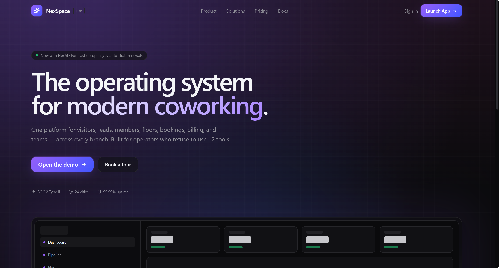

## Dashboard
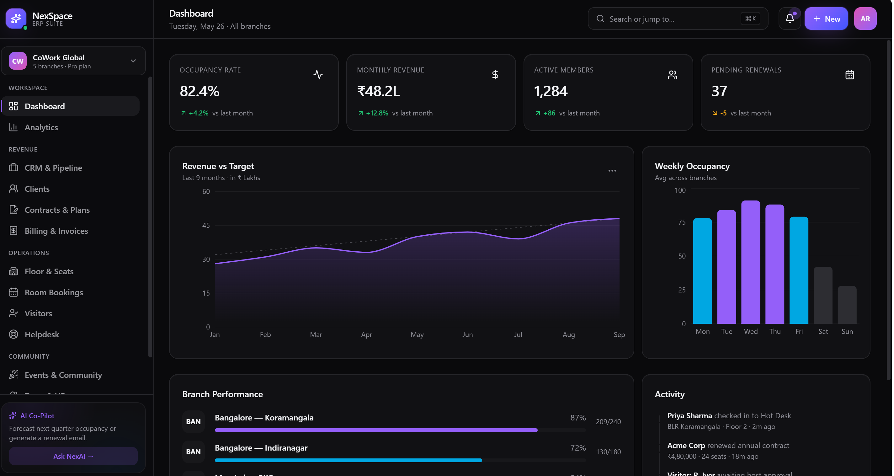

## Analytics
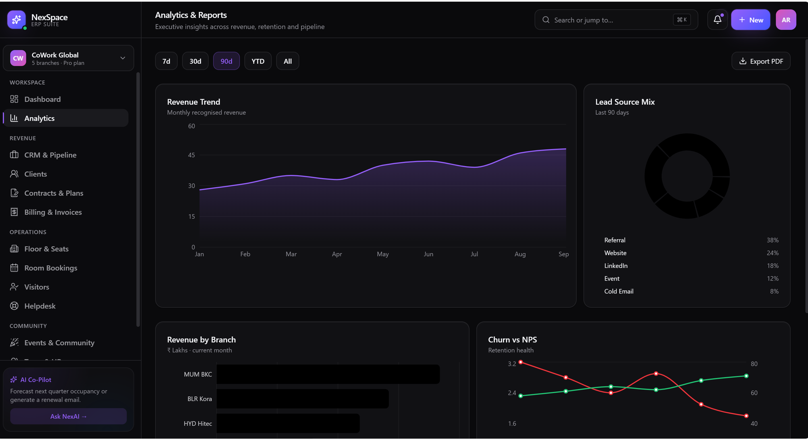

## Clients
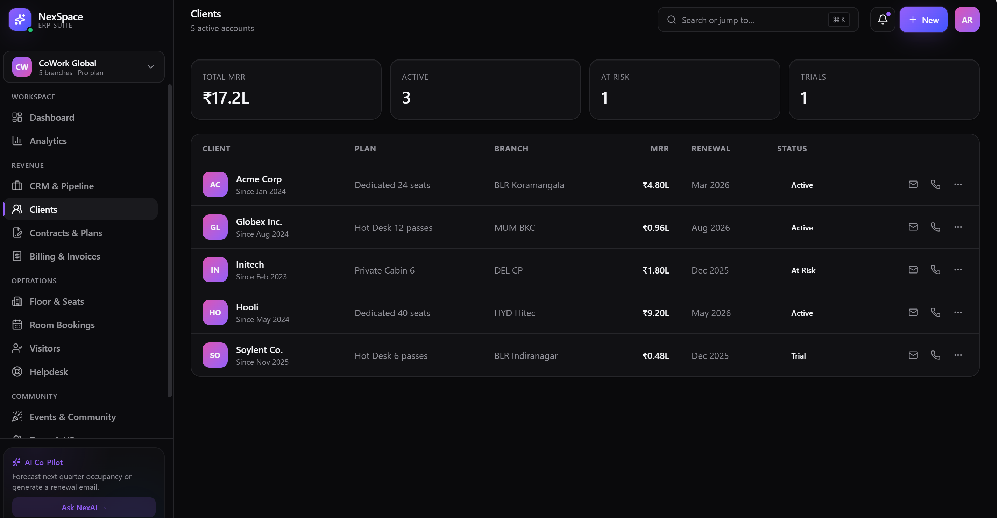

## CRM  Pipeline
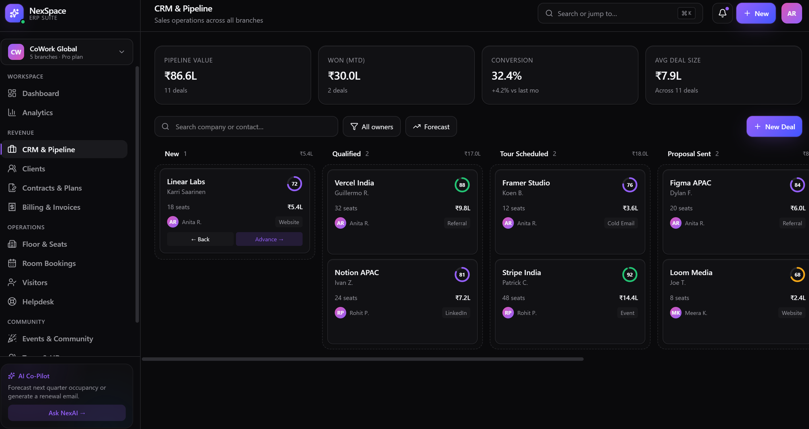

## Events  Community
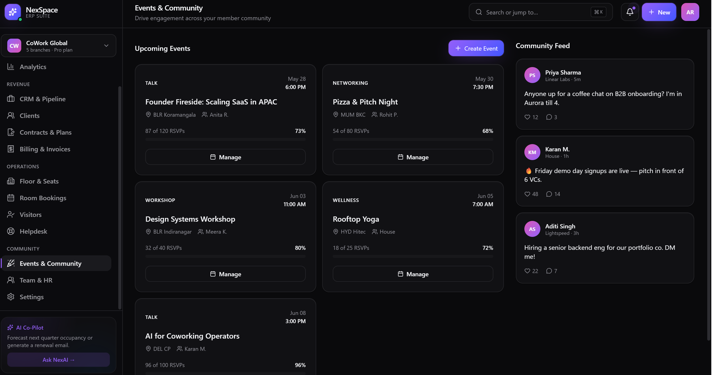

## Floor & Seats
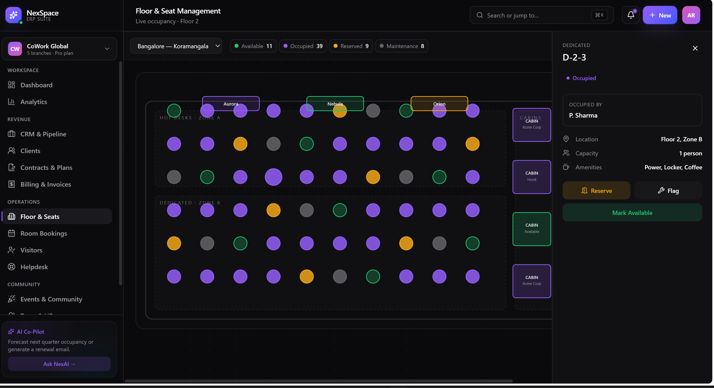

## Helpdesk
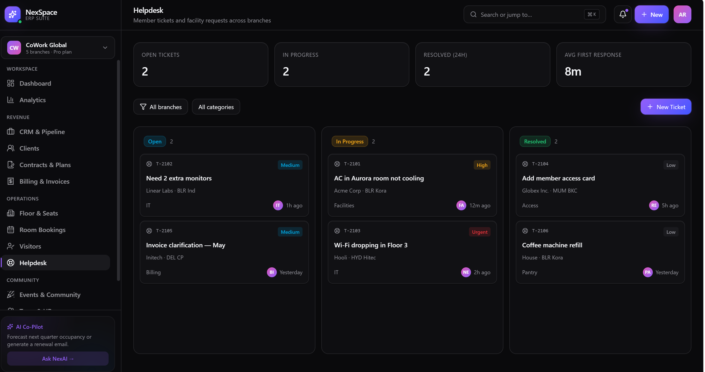

## Room Bookings
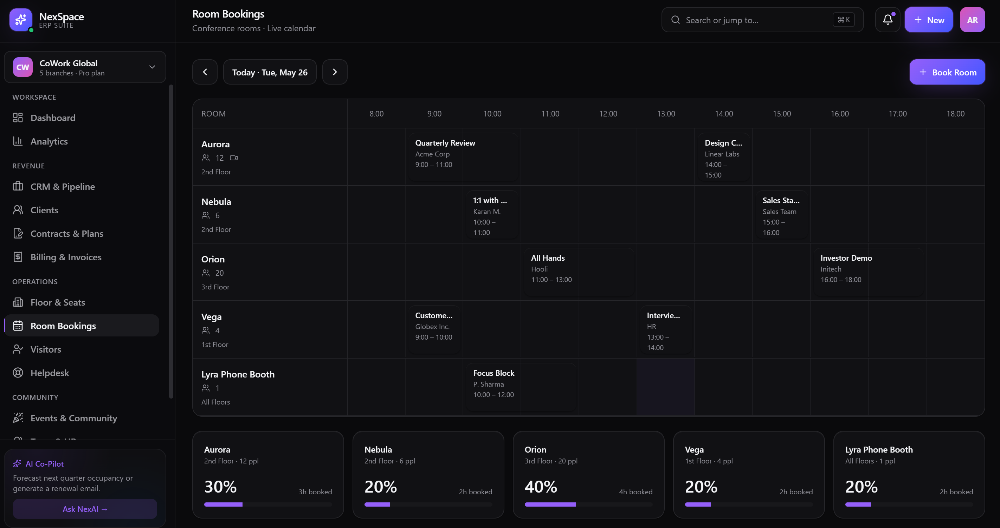

## Settings
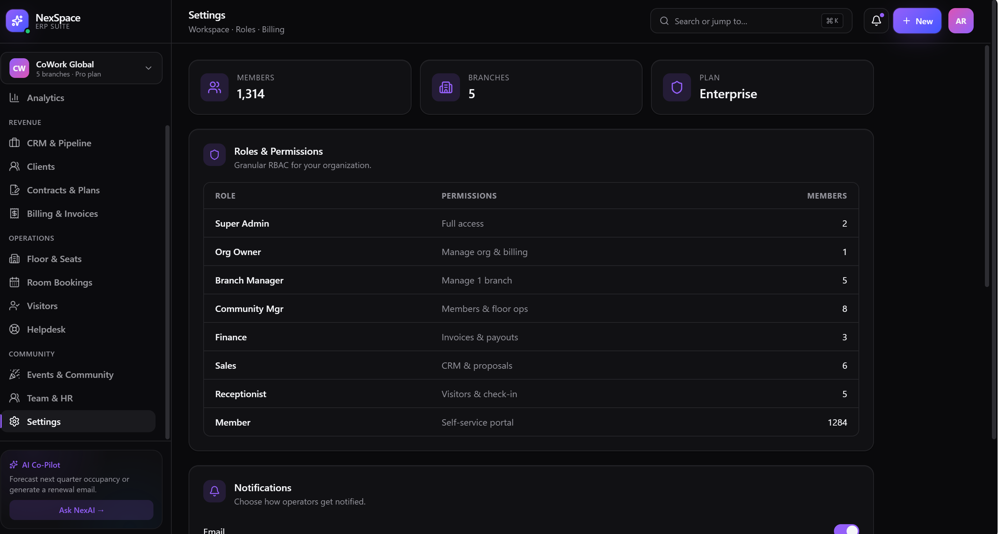

## Team & HR
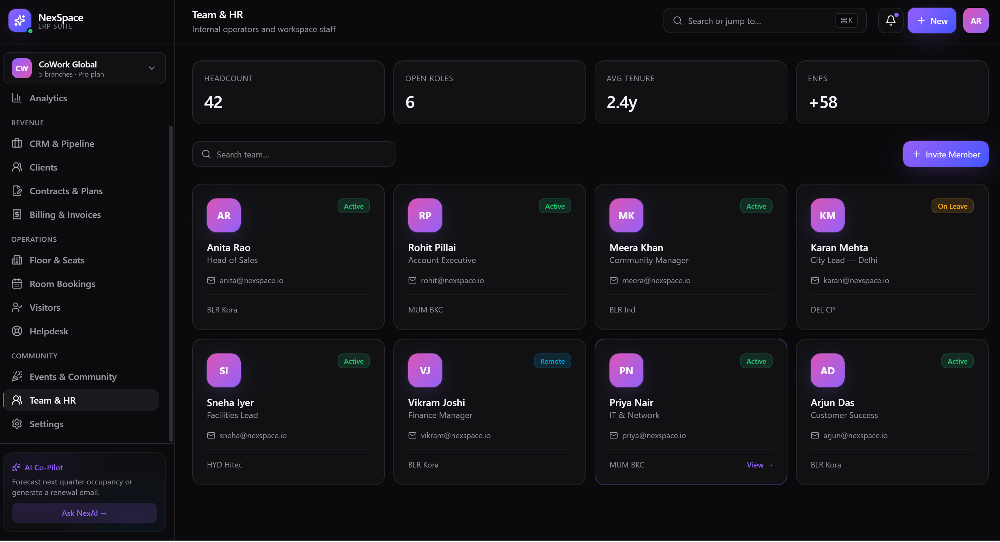

## Visitor Management
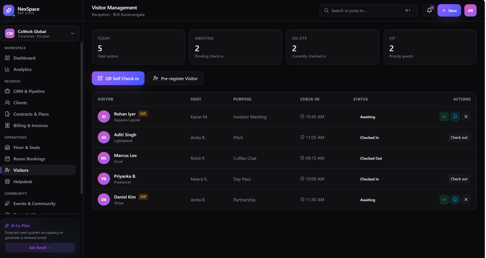

# Core Features

## Workspace & Operations Management
- Interactive floor & seat management
- Live occupancy tracking
- Workspace availability monitoring
- Multi-branch operations dashboard
- Real-time workspace analytics
- Smart workspace allocation system

---

## CRM & Client Management
- Lead pipeline management
- Client onboarding workflows
- Contract & agreement tracking
- CRM dashboard system
- Renewal management
- Proposal & quotation workflows
- Customer lifecycle management

---

## Conference Room Booking System
- Meeting room bookings
- Real-time availability management
- Calendar-based scheduling
- Booking workflow system
- Operational booking dashboard

---

## Visitor Management System
- Digital visitor workflows
- QR-based visitor handling
- Visitor tracking dashboard
- Smart check-in/check-out system
- Reception operations management

---

## Analytics & Insights
- Revenue analytics dashboard
- Occupancy insights
- Branch performance monitoring
- Operational KPI tracking
- Business analytics visualization
- Real-time reporting system

---

## Team & Internal Management
- Team management workflows
- Internal operational dashboards
- Helpdesk system
- Event & community management
- Role-based operational structure
- Administrative workflows

---

# UI/UX Highlights

- Premium enterprise SaaS dashboard
- Futuristic dark UI system
- Responsive modern layouts
- Interactive analytics visualizations
- Smooth animations & transitions
- Advanced card-based dashboard system
- Glassmorphism-inspired interface
- Modern sidebar navigation
- Real-time dashboard experience
- Scalable reusable component system

---

# Technical Highlights

- Modular frontend architecture
- Scalable route management
- Type-safe application structure
- Optimized rendering workflows
- Reusable enterprise UI system
- Component-driven development
- Modern dashboard architecture
- High-performance frontend rendering

---

# Main Modules

```bash
/dashboard
/analytics
/crm
/clients
/contracts
/billing
/bookings
/floor
/visitors
/helpdesk
/team
/events
/settings
```

---

# Project Structure

```bash
src/
 ├── components/
 │    ├── layout/
 │    └── ui/
 │
 ├── hooks/
 ├── lib/
 ├── routes/
 │    └── _shell/
 │
 ├── styles/
 ├── router.tsx
 ├── server.ts
 └── start.ts
```

---

# Technology Stack

## Frontend
- React
- TypeScript
- Vite
- TanStack Router
- Tailwind CSS
- ShadCN UI
- Framer Motion
- Redux Toolkit
- React Hook Form
- Zod Validation
- Recharts

---

## UI Libraries
- Radix UI
- Lucide React
- Sonner
- CMDK
- Embla Carousel

---

## Runtime & Deployment
- Bun
- Cloudflare Workers
- Wrangler

---

# Performance & Architecture

- Optimized frontend rendering
- Lazy-loaded modular architecture
- Responsive enterprise layouts
- Type-safe routing system
- Reusable scalable component system
- Fast Vite-based development workflow
- Modern frontend optimization techniques

---

# Future Roadmap

- AI-powered workspace assistant
- Occupancy forecasting engine
- Smart operational automation
- Multi-tenant SaaS backend
- Real-time collaboration system
- Mobile application support
- Payment gateway integration
- Advanced analytics engine
- AI-driven operational insights

---

# Why NexSpace ERP?

NexSpace ERP was designed to reimagine how modern coworking businesses manage their operations by combining enterprise workflows, operational intelligence, modern UI/UX, and scalable architecture into one unified platform.

The project represents the vision of building a modern operating system for coworking spaces that eliminates fragmented tools and simplifies operational management through a centralized SaaS ecosystem.

---

# Author

Built with a vision to modernize coworking operations through scalable SaaS architecture and enterprise-grade user experience.

---

# License

MIT License
